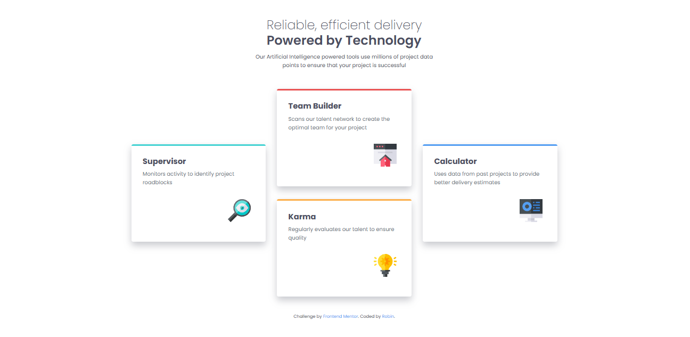
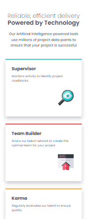

# Frontend Mentor - Four card feature section solution

This is a solution to the [Four card feature section challenge on Frontend Mentor](https://www.frontendmentor.io/challenges/four-card-feature-section-weK1eFYK). Frontend Mentor challenges help you improve your coding skills by building realistic projects.

## Table of contents

- [Overview](#overview)
  - [The challenge](#the-challenge)
  - [Screenshot](#screenshot)
  - [Links](#links)
- [My process](#my-process)
  - [Built with](#built-with)
  - [What I learned](#what-i-learned)
  - [Continued development](#continued-development)
  - [Useful resources](#useful-resources)
- [Author](#author)
- [Acknowledgments](#acknowledgments)

## Overview

### The challenge

Users should be able to:

- View the optimal layout for the site depending on their device's screen size

### Screenshot

### Links

- Solution URL: [Frontendmentor](https://www.frontendmentor.io/solutions/four-card-feature-gGSi-woVss)
- Live Site URL: [Github](https://github.com/TheRoboRobin/Frontend-Mentor-Product-Preview-Card)

## My process

I began by writing an outline. I'm planning to structure the cards container as a grid. Make it super easy to lay out the cards how I need. Because that seems to be the main focus of the challenge, I'm going to start with desktop first workflow.

It was all fairly easy to write out in html. The only issue I had was that I overlooked an error with how my json was looking for assets to bring over to public. And so had to troubleshoot why my svgs weren't showing up. I ended up adding a container on the heading text after starting my scss. Made it easier to get the text to lay how I wanted.

Building out the css was super straight forward. All things considered its a very basic component. I ended up putting a minmax on the grid columns to make it respond more smoothly. And later when doing the media queries, I altered how some things were structured just to make it respond better in the end.

### Built with

- Semantic HTML5 markup
- CSS custom properties
- Flexbox
- CSS Grid
- Sass
- GitHub Actions

### What I learned

This was mainly an exercise in what is necessary to think responsively in the start. There is of course things that I didn't really think about that I later had to add to make it more responsive in the end. I could maybe do better on making the font sizes more responsive up front with calc and clamp like previously talked about in the course.

### Continued development

I want to do a better job of structuring responsively up front. Not having to go back and restructure because it won't respond responsively. But that comes with practice.

## Author

- Website - [Robin](https://github.com/TheRoboRobin)
- Frontend Mentor - [@TheRoboRobin](https://www.frontendmentor.io/profile/TheRoboRobin)

## Acknowledgements

- Thank you to Akiz-Ivanov for their comment. [@Akiz-Ivanov] (https://www.frontendmentor.io/profile/Akiz-Ivanov)
